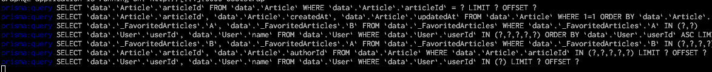

# prisma-query-log

Log prisma query event

Features:

-   Substitute parameters
-   Remove backticks and database prefix

Before:



After:


## Install

```sh
npm install --save-dev prisma-query-log
```

## Usage

```typescript
import { createPrismaQueryEventHandler } from 'prisma-query-log';
import { PrismaClient } from '@prisma/client';

const prisma = new PrismaClient({
    log: [
        {
            level: 'query',
            emit: 'event',
        },
    ],
});

const log = createPrismaQueryEventHandler();

prisma.$on('query', log);
```

## API

```ts
function createPrismaQueryEventHandler(
    args?: CreatePrismaQueryEventHandlerArgs,
): (event: PrismaQueryEvent) => void;

type CreatePrismaQueryEventHandlerArgs = {
    /**
     * Boolean of custom log function,
     * if true `console.log` will be used,
     * if false noop - logs nothing.
     * Default: true
     */
    logger?: boolean | ((query: string) => unknown);
    /**
     * Remove backticks.
     */
    unescape?: boolean;
};
```
